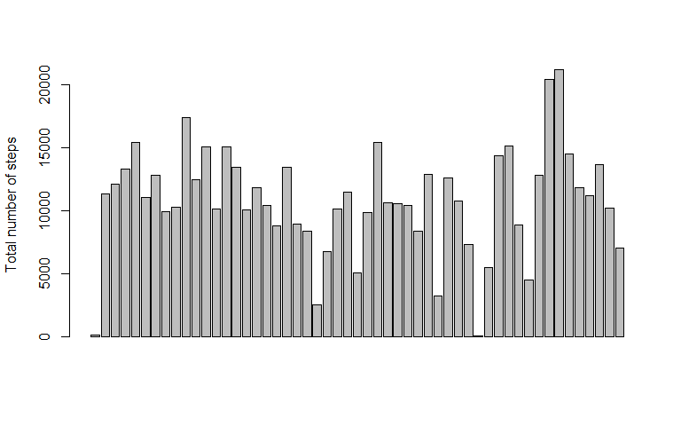
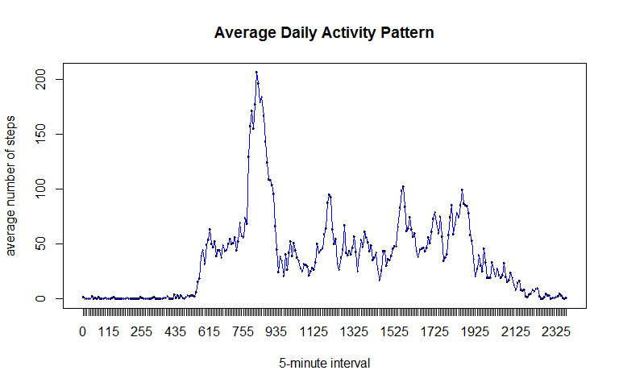
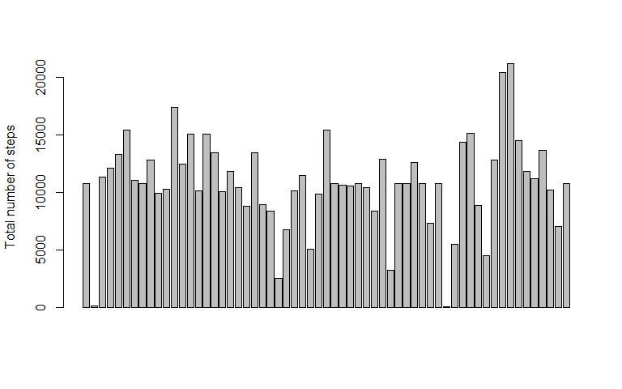
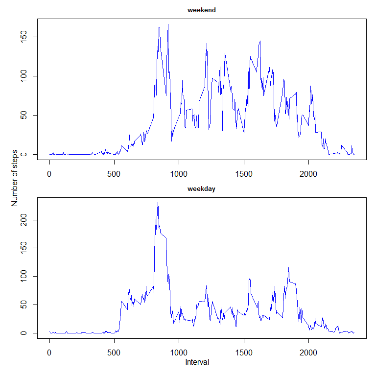

# Reproducible Research: Peer Assessment 1


## Loading and preprocessing the data

1. Load the data (i.e. read.csv())

```r
# Set to the current working directory
# Assume activity.csv is in the current working directory

# use rm(list = ls()) to clean the working environment before runing the testing
rm(list = ls())

# Load the data 
activity <- read.csv("./activity.csv")
```

2. Process/transform the data (if necessary) into a format suitable for your analysis

```r
# Remove the rows with "steps=NA" 
data <- activity[!is.na(activity$steps), ]
```


## What is mean total number of steps taken per day?

For this part of the assignment, you can ignore the missing values in the dataset.

1. Make a histogram of the total number of steps taken each day

```r
# get the sum of steps for each day
sum_steps <- aggregate(steps ~ date, data=data, sum)

# plot the barplot
barplot(sum_steps$steps, names.arg=sum_steps$year, xlab="", ylab="Total number of steps")
```

 

2. Calculate and report the mean and median total number of steps taken per day

```r
mean_steps   <- aggregate(steps ~ date, data=data, mean)
median_steps <- aggregate(steps ~ date, data=data, median)
mean_median_steps <- merge(mean_steps, median_steps, by="date")
names(mean_median_steps) <- c("Date", "mean_steps", "median_steps")
print(mean_median_steps, type="html")
```

```
##          Date mean_steps median_steps
## 1  2012-10-02  0.4375000            0
## 2  2012-10-03 39.4166667            0
## 3  2012-10-04 42.0694444            0
## 4  2012-10-05 46.1597222            0
## 5  2012-10-06 53.5416667            0
## 6  2012-10-07 38.2465278            0
## 7  2012-10-09 44.4826389            0
## 8  2012-10-10 34.3750000            0
## 9  2012-10-11 35.7777778            0
## 10 2012-10-12 60.3541667            0
## 11 2012-10-13 43.1458333            0
## 12 2012-10-14 52.4236111            0
## 13 2012-10-15 35.2048611            0
## 14 2012-10-16 52.3750000            0
## 15 2012-10-17 46.7083333            0
## 16 2012-10-18 34.9166667            0
## 17 2012-10-19 41.0729167            0
## 18 2012-10-20 36.0937500            0
## 19 2012-10-21 30.6284722            0
## 20 2012-10-22 46.7361111            0
## 21 2012-10-23 30.9652778            0
## 22 2012-10-24 29.0104167            0
## 23 2012-10-25  8.6527778            0
## 24 2012-10-26 23.5347222            0
## 25 2012-10-27 35.1354167            0
## 26 2012-10-28 39.7847222            0
## 27 2012-10-29 17.4236111            0
## 28 2012-10-30 34.0937500            0
## 29 2012-10-31 53.5208333            0
## 30 2012-11-02 36.8055556            0
## 31 2012-11-03 36.7048611            0
## 32 2012-11-05 36.2465278            0
## 33 2012-11-06 28.9375000            0
## 34 2012-11-07 44.7326389            0
## 35 2012-11-08 11.1770833            0
## 36 2012-11-11 43.7777778            0
## 37 2012-11-12 37.3784722            0
## 38 2012-11-13 25.4722222            0
## 39 2012-11-15  0.1423611            0
## 40 2012-11-16 18.8923611            0
## 41 2012-11-17 49.7881944            0
## 42 2012-11-18 52.4652778            0
## 43 2012-11-19 30.6979167            0
## 44 2012-11-20 15.5277778            0
## 45 2012-11-21 44.3993056            0
## 46 2012-11-22 70.9270833            0
## 47 2012-11-23 73.5902778            0
## 48 2012-11-24 50.2708333            0
## 49 2012-11-25 41.0902778            0
## 50 2012-11-26 38.7569444            0
## 51 2012-11-27 47.3819444            0
## 52 2012-11-28 35.3576389            0
## 53 2012-11-29 24.4687500            0
```

## What is the average daily activity pattern?

1. Make a time series plot (i.e. type = "l") of the 5-minute interval (x-axis) and the average number of steps taken, averaged across all days (y-axis)


```r
data$interval <- factor(data$interval)
ave_steps_interval <- aggregate(steps ~ interval, data=data, mean)

plot(ave_steps_interval$interval, ave_steps_interval$steps,
           xlab="5-minute interval", ylab="average number of steps", 
           main="Average Daily Activity Pattern", pch=19)
lines(ave_steps_interval$interval,ave_steps_interval$steps, type="l") 
```

 

2. Which 5-minute interval, on average across all the days in the dataset, contains the maximum number of steps?


```r
max_five_minute_interval <- ave_steps_interval[ave_steps_interval$steps==max(ave_steps_interval$steps), ][1]
print(max_five_minute_interval, type="html")
```

```
##     interval
## 104      835
```

## Imputing missing values

Note that there are a number of days/intervals where there are missing values (coded as NA). The presence of missing days may introduce bias into some calculations or summaries of the data.

1. Calculate and report the total number of missing values in the dataset (i.e. the total number of rows with NAs)  


```r
data_na <- activity[is.na(activity$steps), ]

print(nrow(data_na), type="html")
```

```
## [1] 2304
```

2. Devise a strategy for filling in all of the missing values in the dataset. The strategy does not need to be sophisticated. For example, you could use the mean/median for that day, or the mean for that 5-minute interval, etc.  


```r
# Devise imputation strategy for missing data
print("Imputation strategy for missing data: Use the mean for the 5-minute interval to replace NA", type="html")
```

```
## [1] "Imputation strategy for missing data: Use the mean for the 5-minute interval to replace NA"
```


```r
# use the mean for the 5-minute interval in data frame "ave_steps_interval" to replace NA in data frame "data_na"
step <-0
while (step <= 2355)
{
        # get the mean for the 5-minute interval in data frame "ave_steps_interval"
        ave_step <- ave_steps_interval[ave_steps_interval$interval==step, ][2]
        
        # Repalce the NA with the above number for the specific "interval" in data frame "data_na"
        data_na[data_na$interval==step, ]$steps <- rep(ave_step, nrow(data_na[data_na$interval==step, ]))
        
        # Increate steps by 5 minutes
        step <- step + 5
}
```

3. Create a new dataset that is equal to the original dataset but with the missing data filled in.  


```r
# create a new data frame "new_activity"
new_activity <- rbind(data_na, data)
new_activity$steps <- as.numeric(new_activity$steps)
new_activity$interval <- factor(new_activity$interval)
```

4. Make a histogram of the total number of steps taken each day and Calculate and report the mean and median total number of steps taken per day. Do these values differ from the estimates from the first part of the assignment? What is the impact of imputing missing data on the estimates of the total daily number of steps? 


```r
# There are 61 days with valid total number of steps
sum_steps <- aggregate(steps ~ date, data=new_activity, sum)

# Plot the histogram of the total number of steps taken each day
barplot(sum_steps$steps, names.arg=sum_steps$year, xlab="", ylab="Total number of steps")
```

 


```r
# Calculate and report the mean and median total number of steps taken per day
mean_steps <- aggregate(steps ~ date, data=new_activity, mean)
median_steps <- aggregate(steps ~ date, data=new_activity, median)
mean_median_steps <- merge(mean_steps, median_steps, by="date")
names(mean_median_steps) <- c("Date", "mean_steps", "median_steps")
print(mean_median_steps, type="html")
```

```
##          Date mean_steps median_steps
## 1  2012-10-01 37.3825996     34.11321
## 2  2012-10-02  0.4375000      0.00000
## 3  2012-10-03 39.4166667      0.00000
## 4  2012-10-04 42.0694444      0.00000
## 5  2012-10-05 46.1597222      0.00000
## 6  2012-10-06 53.5416667      0.00000
## 7  2012-10-07 38.2465278      0.00000
## 8  2012-10-08 37.3825996     34.11321
## 9  2012-10-09 44.4826389      0.00000
## 10 2012-10-10 34.3750000      0.00000
## 11 2012-10-11 35.7777778      0.00000
## 12 2012-10-12 60.3541667      0.00000
## 13 2012-10-13 43.1458333      0.00000
## 14 2012-10-14 52.4236111      0.00000
## 15 2012-10-15 35.2048611      0.00000
## 16 2012-10-16 52.3750000      0.00000
## 17 2012-10-17 46.7083333      0.00000
## 18 2012-10-18 34.9166667      0.00000
## 19 2012-10-19 41.0729167      0.00000
## 20 2012-10-20 36.0937500      0.00000
## 21 2012-10-21 30.6284722      0.00000
## 22 2012-10-22 46.7361111      0.00000
## 23 2012-10-23 30.9652778      0.00000
## 24 2012-10-24 29.0104167      0.00000
## 25 2012-10-25  8.6527778      0.00000
## 26 2012-10-26 23.5347222      0.00000
## 27 2012-10-27 35.1354167      0.00000
## 28 2012-10-28 39.7847222      0.00000
## 29 2012-10-29 17.4236111      0.00000
## 30 2012-10-30 34.0937500      0.00000
## 31 2012-10-31 53.5208333      0.00000
## 32 2012-11-01 37.3825996     34.11321
## 33 2012-11-02 36.8055556      0.00000
## 34 2012-11-03 36.7048611      0.00000
## 35 2012-11-04 37.3825996     34.11321
## 36 2012-11-05 36.2465278      0.00000
## 37 2012-11-06 28.9375000      0.00000
## 38 2012-11-07 44.7326389      0.00000
## 39 2012-11-08 11.1770833      0.00000
## 40 2012-11-09 37.3825996     34.11321
## 41 2012-11-10 37.3825996     34.11321
## 42 2012-11-11 43.7777778      0.00000
## 43 2012-11-12 37.3784722      0.00000
## 44 2012-11-13 25.4722222      0.00000
## 45 2012-11-14 37.3825996     34.11321
## 46 2012-11-15  0.1423611      0.00000
## 47 2012-11-16 18.8923611      0.00000
## 48 2012-11-17 49.7881944      0.00000
## 49 2012-11-18 52.4652778      0.00000
## 50 2012-11-19 30.6979167      0.00000
## 51 2012-11-20 15.5277778      0.00000
## 52 2012-11-21 44.3993056      0.00000
## 53 2012-11-22 70.9270833      0.00000
## 54 2012-11-23 73.5902778      0.00000
## 55 2012-11-24 50.2708333      0.00000
## 56 2012-11-25 41.0902778      0.00000
## 57 2012-11-26 38.7569444      0.00000
## 58 2012-11-27 47.3819444      0.00000
## 59 2012-11-28 35.3576389      0.00000
## 60 2012-11-29 24.4687500      0.00000
## 61 2012-11-30 37.3825996     34.11321
```


```r
# Do these values differ from the estimates from the first part of the assignment? 
print("Yes, these values diff from the estimates from the 1st part", type="html")
```

```
## [1] "Yes, these values diff from the estimates from the 1st part"
```

```r
# What is the impact of imputing missing data on the estimates of the total daily number of steps? 
print("Several median values are non-zero after imputing missing data", type="html")
```

```
## [1] "Several median values are non-zero after imputing missing data"
```
## Are there differences in activity patterns between weekdays and weekends?

For this part the weekdays() function may be of some help here. Use the dataset with the filled-in missing values for this part.  

1. Create a new factor variable in the dataset with two levels - "weekday" and "weekend" indicating whether a given date is a weekday or weekend day.  


```r
# add a new column"weekdayorweekend" to the new data set "new_activity"
new_activity$weekdayorweekend <- weekdays(as.Date(levels(new_activity$date)[new_activity$date]))

# replace "Sat" & "Sun" with "weekend"
new_activity_weekend <- new_activity[new_activity$weekdayorweekend=="Sunday" | new_activity$weekdayorweekend=="Saturday", ]
new_activity_weekend$weekdayorweekend <- rep("weekend", nrow(new_activity_weekend))

# replace ""Mon" - "Fri" with "weekday""
new_activity_weekday <- new_activity[new_activity$weekdayorweekend !="Sunday" & new_activity$weekdayorweekend !="Saturday", ]
new_activity_weekday$weekdayorweekend <- rep("weekday", nrow(new_activity_weekday))

## merge "new_activity_weekend" and "new_activity_weekday" together
new_data <- rbind(new_activity_weekend, new_activity_weekday)
new_data$steps <- as.numeric(new_data$steps)
new_data$weekdayorweekend <- factor(new_data$weekdayorweekend)
```

2. Make a panel plot containing a time series plot (i.e. type = "l") of the 5-minute interval (x-axis) and the average number of steps taken, averaged across all weekday days or weekend days (y-axis). See the README file in the GitHub repository to see an example of what this plot should look like using simulated data.  


```r
mean_steps_weekday <- aggregate(steps ~ interval, data=new_activity_weekday, mean)
mean_steps_weekend <- aggregate(steps ~ interval, data=new_activity_weekend, mean)

# sort by interval
mean_steps_weekday$interval <- as.numeric(levels(mean_steps_weekday$interval))[mean_steps_weekday$interval]
mean_steps_weekday <- mean_steps_weekday[order(mean_steps_weekday$interval), ]

mean_steps_weekend$interval <- as.numeric(levels(mean_steps_weekend$interval))[mean_steps_weekend$interval]
mean_steps_weekend <- mean_steps_weekend[order(mean_steps_weekend$interval), ]

## Use plot() 
par(mfrow=c(2,1), mar=c(2,2,2,1), oma=c(2,2,0,0))
plot(mean_steps_weekend$interval, mean_steps_weekend$steps, type="l", col="blue", xlab="", ylab="", main="weekend", cex.main=0.8)
plot(mean_steps_weekday$interval, mean_steps_weekday$steps, type="l", col="blue", xlab="", ylab="", main="weekday", cex.main=0.8)
mtext("Number of steps", side=2, outer=TRUE)
mtext("Interval", side=1, outer=TRUE)
```

 
